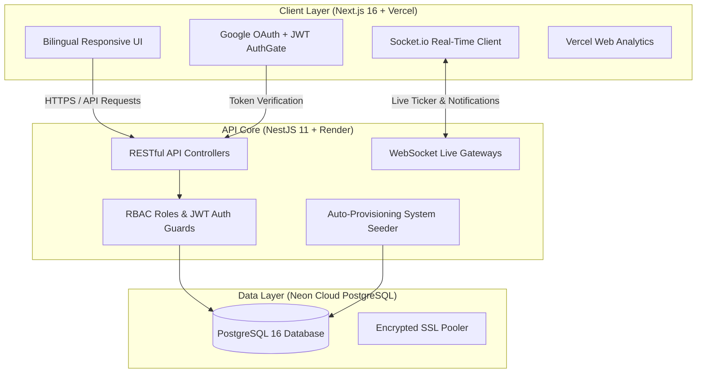

<div align="center">

# 🏛️ Prottoy (প্রত্যয়)
### Unified Civic Transparency & Smart City Ecosystem
**A high-performance digital public infrastructure platform empowering citizens across Bangladesh with verified public issue reporting, encrypted corruption whistleblowing, authentic rental reviews, smart parking management, and municipal services.**

[](https://nextjs.org/)
[](https://nestjs.com/)
[](https://www.typescriptlang.org/)
[](https://tailwindcss.com/)
[](https://www.postgresql.org/)
[](https://prottoy-project.vercel.app)
[](https://prottoy-project.onrender.com)

---

[🌐 Live Web Application](https://prottoy-project.vercel.app) • [🔌 REST API Endpoint](https://prottoy-project.onrender.com) • [📖 Documentation](#-system-architecture)

</div>

---

## 🌟 Executive Overview

**Prottoy (প্রত্যয়)** is a next-generation civic platform designed to bridge the transparency gap between Bangladeshi citizens and municipal authorities. Built with an ultra-responsive Next.js frontend, an enterprise-grade NestJS REST API, and PostgreSQL, the platform delivers high-integrity civic tools with bilingual support (**বাংলা** / **English**) and sleek Dark/Light cinematic interfaces.



---

## ✨ Core Ecosystem Modules

### 1. 🛡️ Citizen Issue Reports & Hazards
- **Geo-Tagged Logging**: Report potholes, water logging, open manholes, power failures, and gas leaks with GPS coordinates and photo evidence.
- **Verification Workflow**: Authority and Field Officer review, status lifecycle tracking (`PENDING` $\rightarrow$ `IN_PROGRESS` $\rightarrow$ `RESOLVED`), and rejection auditing.
- **Democratic Citizen Upvoting**: Citizens upvote severe community issues to escalate municipal priority.
- **Universal Discussion Threads**: Multi-tiered nested comments with author/authority verification badges.

### 2. ⚖️ Anti-Corruption & Whistleblowing (ঘুষ ও দুর্নীতি দমন ভল্ট)
- **100% Encrypted Anonymity**: Zero-log, confidential whistleblower portal to submit evidence against extortion, bribery, and administrative malpractice.
- **Authority Dossier Review**: Secure inspect-and-verify workflow restricted to authorized high-level commissioners.

### 3. 🚗 Smart Municipal Parking Grid
- **Real-Time Bay Telemetry**: Search nearby parking slots with live availability status (`AVAILABLE`, `OCCUPIED`, `MAINTENANCE`).
- **Vehicle Booking & QR Scanning**: Reserve slots with plate number validation, digital parking passes, and attendant validation.
- **Violation Management**: Attendant penalty issuance, citation logging, and instant payment settlement.

### 4. 📦 Lost & Found Custody Vault
- **National Registry**: Report lost and discovered items with categories, serial numbers, locations, and photo attachments.
- **Anti-Fraud Claim Pipeline**: Automated ownership proof verification (authors cannot claim their own posts; authorities mediate item return).

### 5. 🏠 Housing & Rental Review Registry
- **Genuine Tenant Feedback**: Transparent reviews and ratings on landlords, rental units, utility availability, and building safety.
- **Lease Transparency**: Verified tenant badges to eliminate rental scams in major metropolitan hubs.

### 6. 🔧 Verified Trade Services & Work Orders
- **Vetted Local Pros**: Directory of verified electricians, plumbers, appliance technicians, and carpenters.
- **Direct Engagement**: Request quotes, view verified trade badges, and submit authentic ratings upon job completion.

### 7. 🗺️ 64 Districts GIS Telemetry & Analytics
- **Division & District Filtering**: Seamless multi-district filtering covering all 8 administrative divisions of Bangladesh.
- **Real-Time KPI Cards**: Dynamic resolution percentages, active citizen counters, and whistleblower file statistics.

---

## 👥 Role-Based Access Control (RBAC)

The system enforces strict permission boundaries across 4 core roles:

| Role | Default Seed Account | Password | Scope & Permissions |
| :--- | :--- | :--- | :--- |
| **Admin** | `admin@smartcity.gov.bd` | `123456` | Full platform oversight, user management, category administration, district management, telemetry audit |
| **Authority** | `authority@smartcity.gov.bd` | `123456` | Review, approve, assign field officers, and resolve reports, bribery files, and lost & found claims |
| **Field Officer** | `officer@smartcity.gov.bd` | `123456` | On-site report inspections, verification evidence submission, status updates |
| **Citizen** | *Sign in with Google or Register* | *Custom* | Submit reports, whistleblowing files, book parking, post lost items, rate housing & trades |

---

## 🛠️ Technology Stack

### Frontend
- **Framework**: [Next.js 16](https://nextjs.org/) (App Router, Turbopack, Server & Client Components)
- **UI & Styling**: [Tailwind CSS 4](https://tailwindcss.com/), Vanilla CSS Design Tokens
- **Animations**: [Framer Motion](https://www.framer.com/motion/) (Micro-interactions, 3D mouse parallax, dynamic map glow)
- **Mapping & GIS**: [Leaflet](https://leafletjs.com/), [React-Leaflet](https://react-leaflet.js.org/)
- **State & Real-Time**: React Context API, [Socket.io Client](https://socket.io/), [Axios](https://axios-http.com/)
- **Authentication**: [@react-oauth/google](https://www.npmjs.com/package/@react-oauth/google) (Google Identity Services)
- **Observability**: [@vercel/analytics](https://vercel.com/analytics) (Web performance & page view telemetry)

### Backend
- **Framework**: [NestJS 11](https://nestjs.com/) (TypeScript Enterprise Node.js Architecture)
- **Database & ORM**: [PostgreSQL 16](https://www.postgresql.org/), [TypeORM](https://typeorm.io/)
- **Authentication & Security**: Passport.js, JWT, bcryptjs, [google-auth-library](https://www.npmjs.com/package/google-auth-library) (Cryptographic ID token verification)
- **Validation**: `class-validator`, `class-transformer`
- **Real-Time Gateway**: [Socket.io](https://socket.io/) (WebSockets)

### Infrastructure & Deployment
- **Frontend Hosting**: [Vercel](https://vercel.com/) (Automated Continuous Deployment, Global Edge CDN)
- **Backend Hosting**: [Render](https://render.com/) (Containerized Web Service)
- **Database**: [Neon](https://neon.tech/) (Serverless PostgreSQL with SSL pooling)

---

## 🚀 Local Development Setup

### Prerequisites
- Node.js (v18 or higher)
- PostgreSQL (v14 or higher)
- Git

### 1. Clone the Repository
```bash
git clone https://github.com/KHR47/-Prottoy-Project.git
cd -Prottoy-Project
```

### 2. Backend Setup
```bash
cd backend
npm install
```

Create `backend/.env`:
```env
PORT=3001
NODE_ENV=development

DATABASE_HOST=localhost
DATABASE_PORT=5432
DATABASE_USER=postgres
DATABASE_PASSWORD=your_password
DATABASE_NAME=smart_city_db

JWT_SECRET=your_jwt_secret_key_here
FRONTEND_URL=http://localhost:3000
GOOGLE_CLIENT_ID=your-google-client-id.apps.googleusercontent.com
GOOGLE_CLIENT_SECRET=your-google-client-secret
```

Start the backend development server:
```bash
npm run start:dev
```
*(The backend will automatically create tables and seed default Admin and Authority accounts on first run)*.

### 3. Frontend Setup
```bash
cd ../frontend
npm install
```

Create `frontend/.env.local`:
```env
NEXT_PUBLIC_API_URL=http://localhost:3001
NEXT_PUBLIC_GOOGLE_CLIENT_ID=your-google-client-id.apps.googleusercontent.com
```

Start the frontend development server:
```bash
npm run dev
```

Open [http://localhost:3000](http://localhost:3000) in your browser.

---

## 🌐 Production Deployment

### Frontend (Vercel)
1. Import repository in [Vercel](https://vercel.com).
2. Set **Root Directory** to `frontend`.
3. Add Environment Variables:
   - `NEXT_PUBLIC_API_URL`: `https://your-backend-api.onrender.com`
   - `NEXT_PUBLIC_GOOGLE_CLIENT_ID`: `your-google-client-id.apps.googleusercontent.com`
4. Click **Deploy**.

### Backend (Render)
1. Create a **New Web Service** on [Render](https://render.com).
2. Set **Root Directory** to `backend`.
3. Set **Build Command**: `npm install && npm run build`.
4. Set **Start Command**: `npm run start:prod`.
5. Add environment variables for your Neon Cloud PostgreSQL credentials and `FRONTEND_URL`.

---

## 🔒 Security & Privacy Measures

- **Encrypted Whistleblowing**: Whistleblower reports are stored without user ID linkages or identifiable metadata.
- **Password Protection**: Salting and hashing via `bcryptjs` with 10 salt rounds.
- **SSL Enforcement**: Compulsory SSL encryption (`rejectUnauthorized: false` in cloud pooling) for all database transactions.
- **JWT Protection**: Short-lived cryptographic tokens for all authorized API routes.

---

## 👨‍💻 Author & Acknowledgements

Developed by **[KHR47](https://github.com/KHR47)** for the Advanced Web Application Project.

- **Project Name**: Prottoy (প্রত্যয়) Smart City Ecosystem
- **License**: MIT Open Source

---

<div align="center">
  <sub>Built with ❤️ for civic transparency and empowerment across Bangladesh.</sub>
</div>
